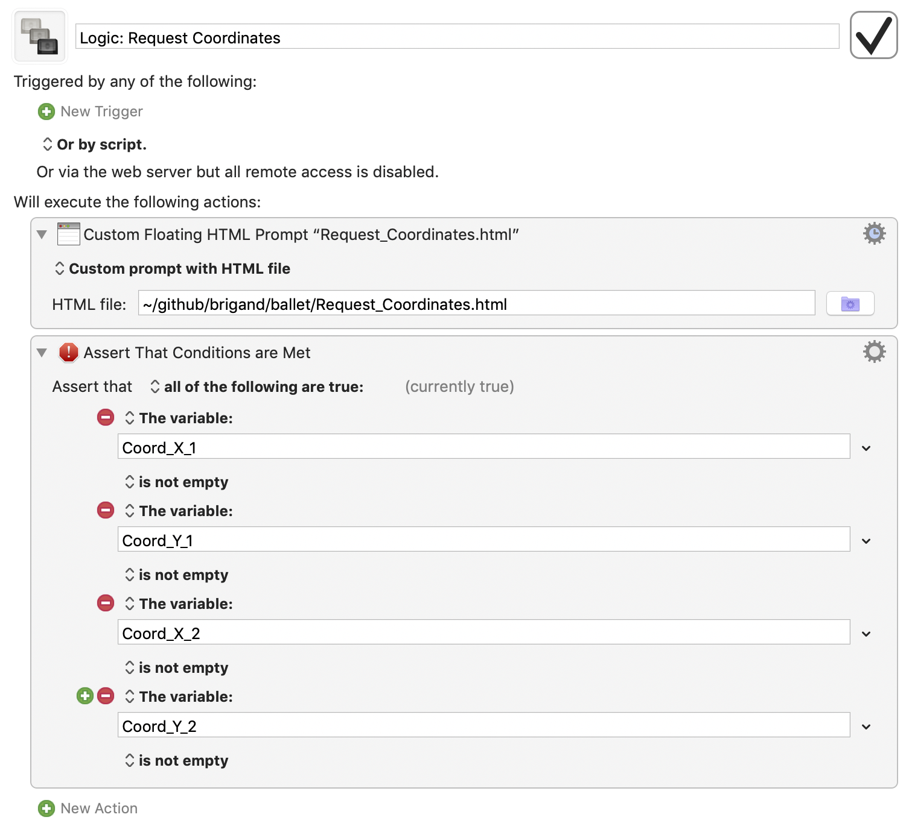
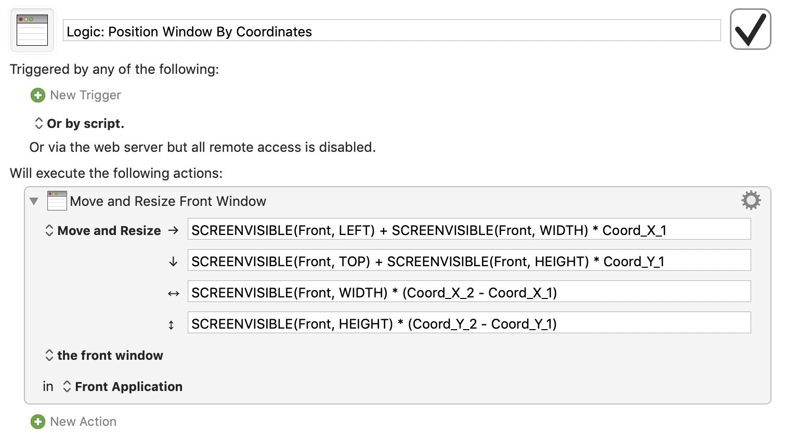
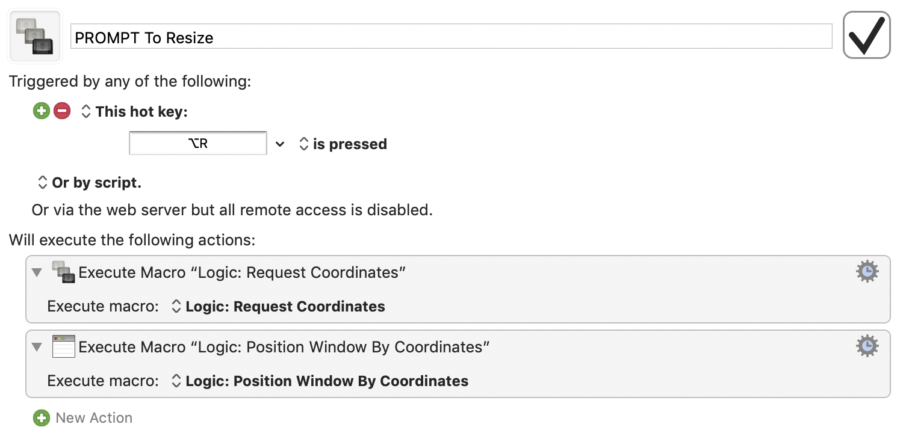
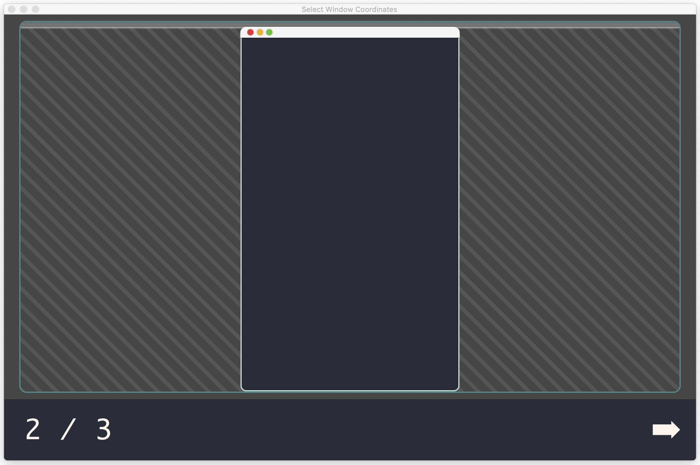
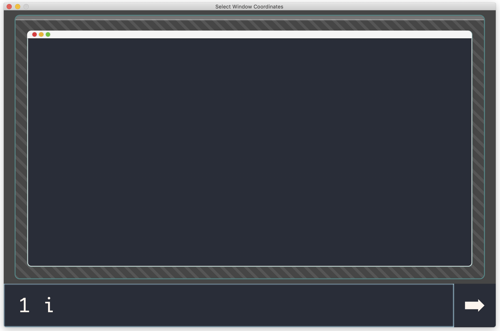
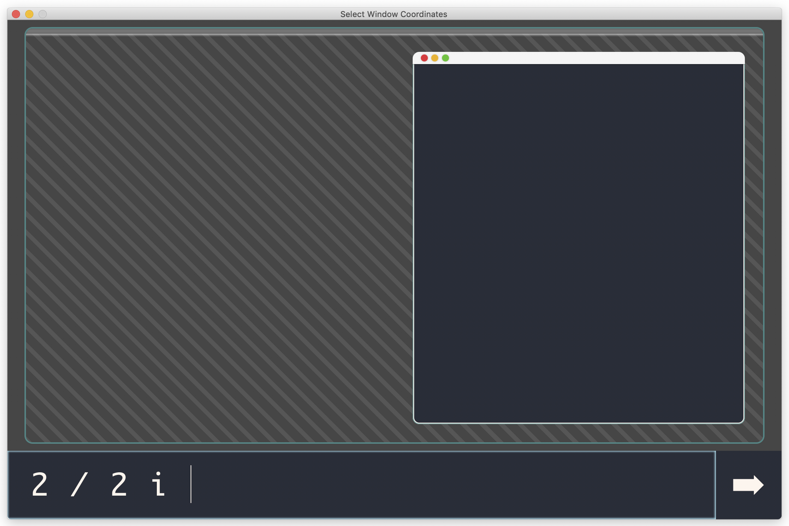
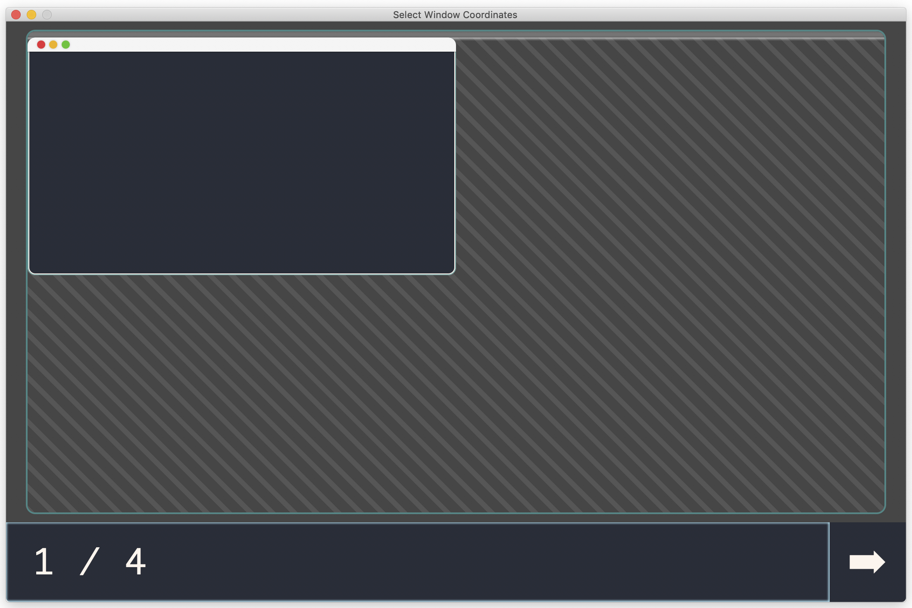
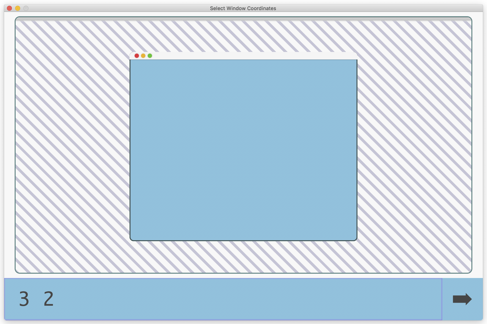

ballet allows you to resize windows using a powerful expression system.

It currently relies on keyboard maestro executing it.

## Install

Currently you need to download the Request_Coordinates.html file, and set up the
macro based on these screenshots.

<details>

<summary>Screenshot of macros</summary>





</details>

## Nines

The most basic way to specify the size is using the 9x9 grid. It's 1-based
because that's the most natural when using the number row on the keyboard, e.g
`1 1 1 1` is the first line on each side of the screen, so maximized.

The structure is very similar to CSS margins, if you're familiar with web
development. For example, just entering `1` is the same as `1 1 1 1` (left 1,
top 1, right 1, bottom 1) and `1 2` is `1 2 1 2`.

If you want the window to be centered, you'll only need to specify 1 or 2
digits.

For example "1 2 3 4" would take the first line from the left of this table, the
top line of the second cell from the top, right line of the third right-most
cell, and fourth line from the bottom of the table.

| []() | []() | []() | []() | []() | []() | []() | []() |
| ---- | ---- | ---- | ---- | ---- | ---- | ---- | ---- |
|  _   |  _   |  _   |  _   |  _   |  _   |  _   |  _   |
|  ◉   |  ◉   |  ◉   |  ◉   |  ◉   |  ◉   |  _   |  _   |
|  ◉   |  ◉   |  ◉   |  ◉   |  ◉   |  ◉   |  _   |  _   |
|  ◉   |  ◉   |  ◉   |  ◉   |  ◉   |  ◉   |  _   |  _   |
|  ◉   |  ◉   |  ◉   |  ◉   |  ◉   |  ◉   |  _   |  _   |
|  ◉   |  ◉   |  ◉   |  ◉   |  ◉   |  ◉   |  _   |  _   |
|  _   |  _   |  _   |  _   |  _   |  _   |  _   |  _   |
|  _   |  _   |  _   |  _   |  _   |  _   |  _   |  _   |
|  _   |  _   |  _   |  _   |  _   |  _   |  _   |  _   |

If you enter no text, it defaults to "1" (maximized).

## Fractions

If you provide e.g. `1 / 2` that is the first half of the screen (left). Other
fractions:

- `2 / 2` - right half
- `3 / 2` - top half (left half + 90 degree rotation)
- `4 / 2` - bottom half
- `1 / 4` - top left quarter
- `2 / 4` - top right quarter
- `3 / 4` - bottom right quarter
- `4 / 4` - bottom left quarter
- `1 / 3` - left third
- `2 / 3` - center third
- `3 / 3` - right third
- `4 / 3` - top third (first third + 90 degree rotation)
- `5 / 3` - middle third
- `6 / 3` - bottom third



## Inset

After the optional "Nines" or "Fractions" component, you can specify certain
special characters to further transform the window position.

One of those features is the "inset" operation that reduces the width/height by
the same number of pixels. Pressing <kbd>i</kbd> adds the inset operator.



This can be very useful for creating nice margins between windows.



You can use <kbd>i</kbd> multiple times to get exponentially increasing inset
amounts, or use the capital <kbd>I</kbd> to do the opposite (outset).

## Other operators

In addition to inset there is <kbd>r</kbd> to rotate 90 degrees clockwise (in
grid units, so e.g `1 / 2` is portait, but `1 / 2 r` is landscape).

<kbd>f</kbd> flips horizontally, and the capital <kbd>F</kbd> flips vertically.

<details>

<summary>Advanced: moving and resizing</summary>

Moving and resizing windows with commands takes a while to get used to,
especially if you're not a vim user.

- <kbd>h</kbd>: left
- <kbd>j</kbd>: down
- <kbd>k</kbd>: up
- <kbd>l</kbd>: right

If you enter e.g. `3 j j`, it'll center the window at the third grid lines, and
then move it down two steps.

If you use a directional key after an <kbd>i</kbd>nsert (or outset), it'll
restrict the inset to that side. You can use <kbd>m</kbd> or <kbd>Space</kbd> to
reset to movement mode.

</details>

## History

The history of previous resize operations is stored in Keyboard Maestro (up to a
limit), and the up/down arrow keys can cycle through it. If you accidentally
press up, just press down to get back to what you were typing.

## Themes

A default dark and light theme are provided. Improvements to these are very
welcome, so please open a pull request if you have a better style!



Edit the HTML file to change the theme.

```diff
<!DOCTYPE html>
- <html lang="en" data-theme="dark">
+ <html lang="en" data-theme="light">
```



You can also customize the CSS variables for the dark or light theme in the same
file.

```diff
:root {
-  --background: #444;
+  --background: hotpink;
- --background-stripe: #555;
+ --background-stripe: limegreen;
```
